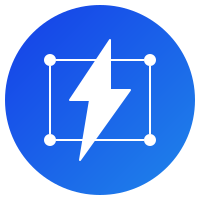

# CDK Power Constructs

<p align="center">
  
</p>

<p align="center">
  <a href="https://www.npmjs.com/package/cdk-power-constructs"></a>
  <a href="https://pypi.org/project/cdk-power-constructs/"></a>
  <a href="https://search.maven.org/artifact/fr.guyon-it-consulting/cdk-power-constructs"></a>
  <a href="https://www.nuget.org/packages/GuyonItConsulting.CdkPowerConstructs"></a>
</p>

<p align="center">
  Opinionated, refined AWS CDK constructs for solving common challenges in Infrastructure, Data, and AI/ML.
</p>

<p align="center">
  📚 <a href="https://guyon-it-consulting.github.io/cdk-power-constructs/"><strong>Documentation</strong></a> | 
  🚀 <a href="https://guyon-it-consulting.github.io/cdk-power-constructs/docs/intro"><strong>Getting Started</strong></a> | 
  📖 <a href="https://guyon-it-consulting.github.io/cdk-power-constructs/api/typescript/"><strong>API Reference</strong></a>
</p>

---

## Features

- 🏗️ **Infrastructure Patterns** - Common infrastructure challenges solved
- 📊 **Data Solutions** - Refined patterns for data pipelines and analytics
- 🤖 **AI/ML Ready** - Purpose-built constructs for ML workflows
- 🎯 **Opinionated Design** - Battle-tested decisions baked in
- 🔒 **Security First** - AWS Well-Architected Framework principles
- 🌍 **Multi-language** - TypeScript, Python, Java, .NET, Go

## Installation

### TypeScript/JavaScript

```bash
npm install cdk-power-constructs
```

### Python

```bash
pip install cdk-power-constructs
```

### Java

```xml
<dependency>
    <groupId>fr.guyon-it-consulting</groupId>
    <artifactId>cdk-power-constructs</artifactId>
    <version>0.1.0</version>
</dependency>
```

### .NET

```bash
dotnet add package GuyonItConsulting.CdkPowerConstructs
```

### Go

```bash
go get github.com/guyon-it-consulting/cdk-power-constructs-go
```

## Quick Start

### TypeScript

```typescript
import { GlueResourcePolicyStatement } from 'cdk-power-constructs/glue/glue-resource-policy';
import * as iam from 'aws-cdk-lib/aws-iam';

new GlueResourcePolicyStatement(stack, 'CrossAccountAccess', {
  sid: 'AllowCrossAccountAccess',
  statement: new iam.PolicyStatement({
    effect: iam.Effect.ALLOW,
    principals: [new iam.AccountPrincipal('123456789012')],
    actions: ['glue:GetDatabase', 'glue:GetTable'],
    resources: ['*'],
  }),
});
```

### Python

```python
from cdk_power_constructs.glue.glue_resource_policy import GlueResourcePolicyStatement
from aws_cdk import aws_iam as iam

GlueResourcePolicyStatement(stack, "CrossAccountAccess",
    sid="AllowCrossAccountAccess",
    statement=iam.PolicyStatement(
        effect=iam.Effect.ALLOW,
        principals=[iam.AccountPrincipal("123456789012")],
        actions=["glue:GetDatabase", "glue:GetTable"],
        resources=["*"]
    )
)
```

## Available Constructs

### GlueResourcePolicyStatement

Manages individual statements in the AWS Glue Data Catalog resource policy for cross-account access and Lake Formation integration.

[View documentation →](https://guyon-it-consulting.github.io/cdk-power-constructs/docs/constructs/glue-resource-policy)

## Documentation

- 📚 [Full Documentation](https://guyon-it-consulting.github.io/cdk-power-constructs/)
- 🚀 [Getting Started Guide](https://guyon-it-consulting.github.io/cdk-power-constructs/docs/intro)
- 📖 [TypeScript API Reference](https://guyon-it-consulting.github.io/cdk-power-constructs/api/typescript/)
- 🐍 [Python API Reference](https://pypi.org/project/cdk-power-constructs/)

## Development

```bash
# Install dependencies
npm install

# Build the library
npm run build

# Run tests
npm test

# Package for all languages
npm run package

# Generate documentation
npm run docs

# Run documentation site locally
cd website && npm start
```

## Contributing

Contributions are welcome! Please see our [documentation](https://guyon-it-consulting.github.io/cdk-power-constructs/) for details.

## License

This project is licensed under the Apache-2.0 License - see the [LICENSE](LICENSE) file for details.

## Author

**Jérôme GUYON**  
[Guyon IT Consulting](https://guyon-it-consulting.fr)

## Links

- 📚 [Documentation](https://guyon-it-consulting.github.io/cdk-power-constructs/)
- 🐛 [Report Issues](https://github.com/guyon-it-consulting/cdk-power-constructs/issues)
- 💬 [Discussions](https://github.com/guyon-it-consulting/cdk-power-constructs/discussions)
- 📦 [npm](https://www.npmjs.com/package/cdk-power-constructs)
- 🐍 [PyPI](https://pypi.org/project/cdk-power-constructs/)
- ☕ [Maven Central](https://search.maven.org/artifact/fr.guyon-it-consulting/cdk-power-constructs)
- 🔷 [NuGet](https://www.nuget.org/packages/GuyonItConsulting.CdkPowerConstructs)
